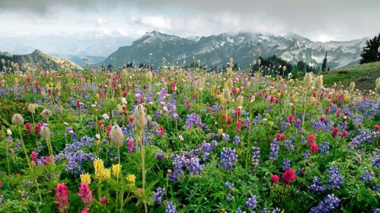
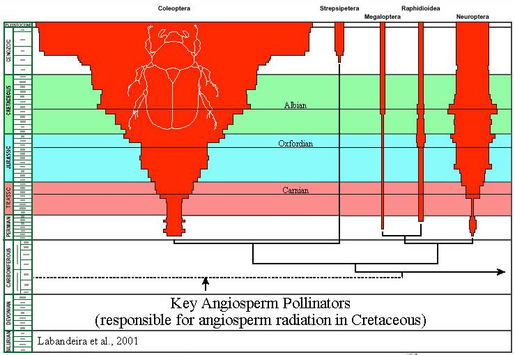
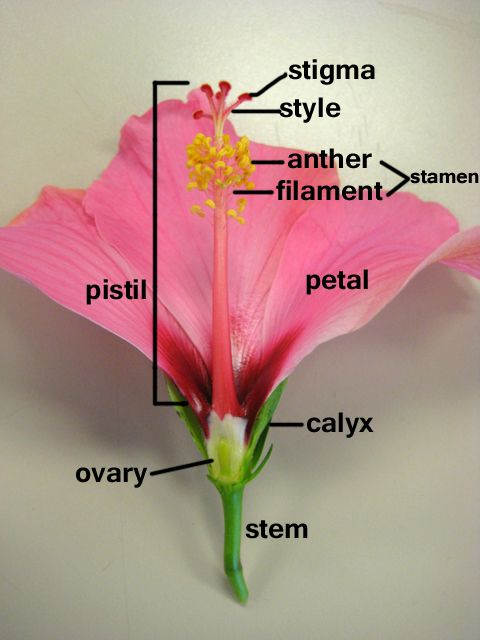

## Vascular plant were the next evolutionary step

## Introduction to heterospory (some lycophytes/ferns)

## Introduction to heterospory (some lycophytes/ferns)

## The big picture: We now live in a seed plant world

 
 

* **Seeds changed the course of plant evolution**
    + Seed plants show up ~360 mya

 

* **Seeds consists of embryo & nutrients**
    + surrounded by protective coat
    + seeds can be dispersed long distances
    + less dependence on water

 

* **2 living seed lineages**
    + gymnosperms (naked seed)
    + angiosperms (covered seed = fruits)
    

## Why seeds matter so much...

 

* **Before seeds, spore was only protective structure** 
    + super small so spread all over Earth

 

* **Seeds are multicellular**
    + what can this add?

 

* **Seeds can remain dormant for a long time**

 

* **Gymnosperms: seeds exposed on sporophylls, form cones**
* **Angiosperms: seeds enclosed inside fruits**

## Seed plants further adapt to life on land

 

* **Reduction of gametophyte**
    + mosses &rarr; ferns &rarr; seed plants
    + gametophytes become microscopic
    + *what are the advantages?*

 

* **Heterosporous life cycle**
    + *2 kinds of spores*
    + form male/female gametopytes

 

* **Ovules**
    + megasporangium kept inside sporophyte
    + ovule contains megaspore
    
 

* **Pollen**
    + microspore develops into pollen grain
    + transfer of pollen to ovule = ?
    

##

## Evolution of gamtetophyte-sporophyte relationship

## Early seed plants and gymnosperms

 
 

* **Seed plant ancestors extinct**
    + oldest fossils in Carboniferous
  
 

* **~300-250 mya climate become drier**
    + Carboniferous &rarr; Permian
    + gymnosperms replaced lycophytes

 

* **Gymnosperms with thin needles thrived till ~ 60 mya**
    + earliest evidence of insect pollination with gymnosperms
    

## 4 living lineages of gymnosperms

* **Cycads**: 300 living species
    + earliest evidence of insect pollination
    + Cycads and dinosaurs lived together

 

* **Gnteophytes**: small and super weird group
    + some flowering traits

 

* **Ginkos**: *Ginkgo biloba* is only species left!
    + landscapers only plant males because...NSFW
    
 

* **Conifers**: ~600 species (cones)
    + evergreen and deciduous
    + leaves are needles or scales

## Welwitchia: the weirdest f'in plant on Earth

## Gymnosperm reproduction: basics

 
 
 

* **Male and female cones on same plant**
    + Cone = strobilus
    + wind pollinated

 

* **Male cones house microsporangium**
    + microsporangium holds microsporocyte (2N)
    + microsporocyte produce pollen grains (1N)

## Gymnosperm reproduction: basics

 
 
 

* **Female cones house megasporangium**
    + megasporangium holds megasporocyte (2N)
    + megasporocyte produce 4 megaspores
    + 1 megaspore (1N) makes it

 

* **Pollen grain reach ovule and germinates**
    + pollen tube grows toward megaspore
    + megaspore develops archegonium with eggs
    + sperm &rarr; pollen tube &rarr; egg

##

## Gymnosperms seeds

## Flowering plant diversity

 

* **Most diverse living group of plants**
    + 14,000 genera, 300,000 species

* **2 classes: Moncots and Dicots**
    + monocots = one seed leaf in embryo
    + dicots = two seed leaf in embryo

## Angiosperm evolution: Bugs and animals

## Flowers

 
 

* **Flower is a modified shoot (stem) for reproduction**
    + has several types of modified leaves...

 

* **Sepals: leaves at base which enclose flower**
    + usually green

 

* **Petals: colored leaves to attract pollinators**
    + less colored if wind pollinated
    

## Flowers - Male

 
 

* **Stamens: microsporophylls**
    + produce microspores that develop into pollen
    + contain anther + filament
    
     

* **Anther: where microsporangia develop**
    + aka Pollen

 
    
* **Filament: stalk that holds the anther**

## Flowers - Female

 
 

* **Stigma: receives pollen**
    + sticky

 

* **Style: leads from stigma to ovary**
    + where pollen tube forms
    
 

* **Ovary: contains ovule**
    + ovule contains female gametophyte

## Angiosperm reproduction: double fertilization

##

## Comparing seed plant reproduction

