## Does having 'Good Genes' make you sexy?

 
 
 

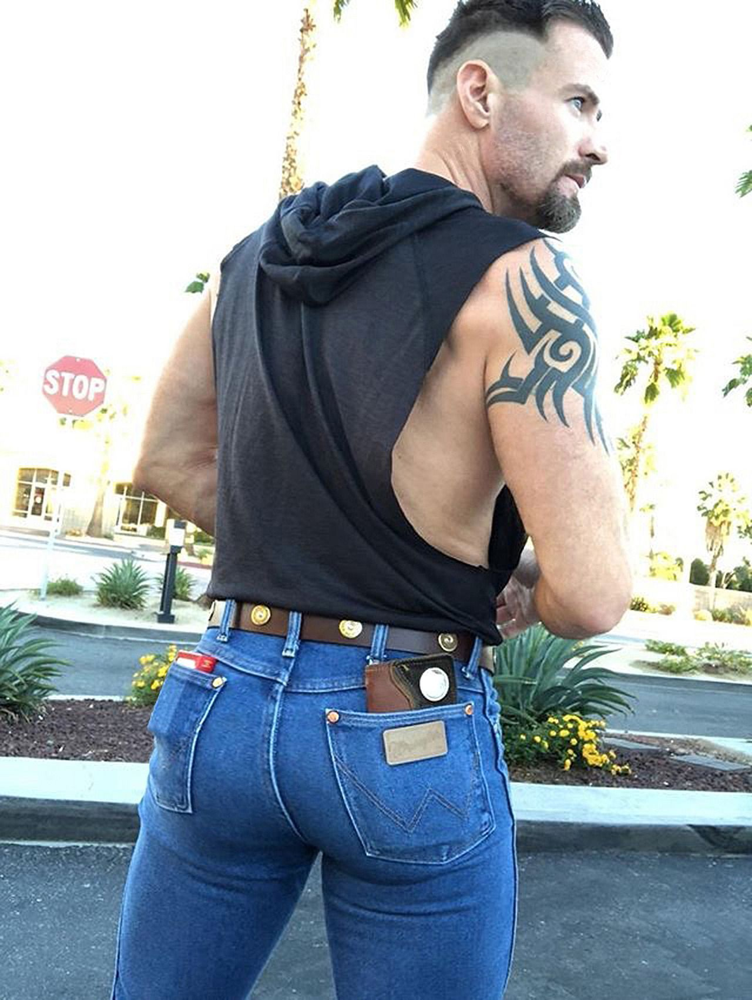

* **Natural Selections tenant #4:**
    + If variation in a heritable trait is associated with variation in reproductive success...
    + those traits accumulate in population

 

* **Sexual Selection: Mating success variation can influence reproductive success**

## Sexual selection is one kind of natural selection

 
 
 

* **Selection can occur as an association between phenotype and mating success**

 

* **Introduces *choosiness* into evolution and reproduction**
    + 'mate choice'

 

* **Often male 'showiness' in naure**
    + benefits versus risks...

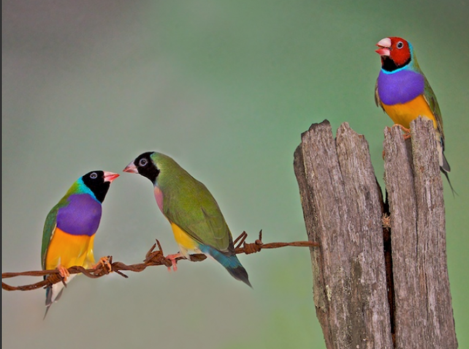

## Is this why males look and behave differently?

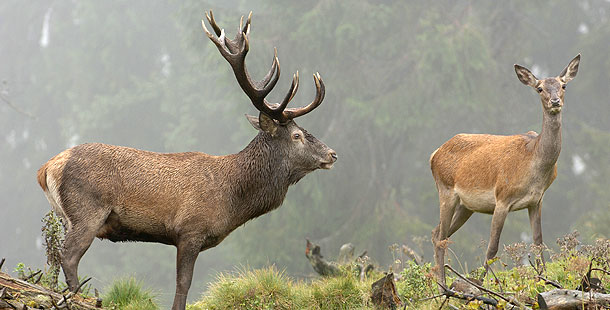

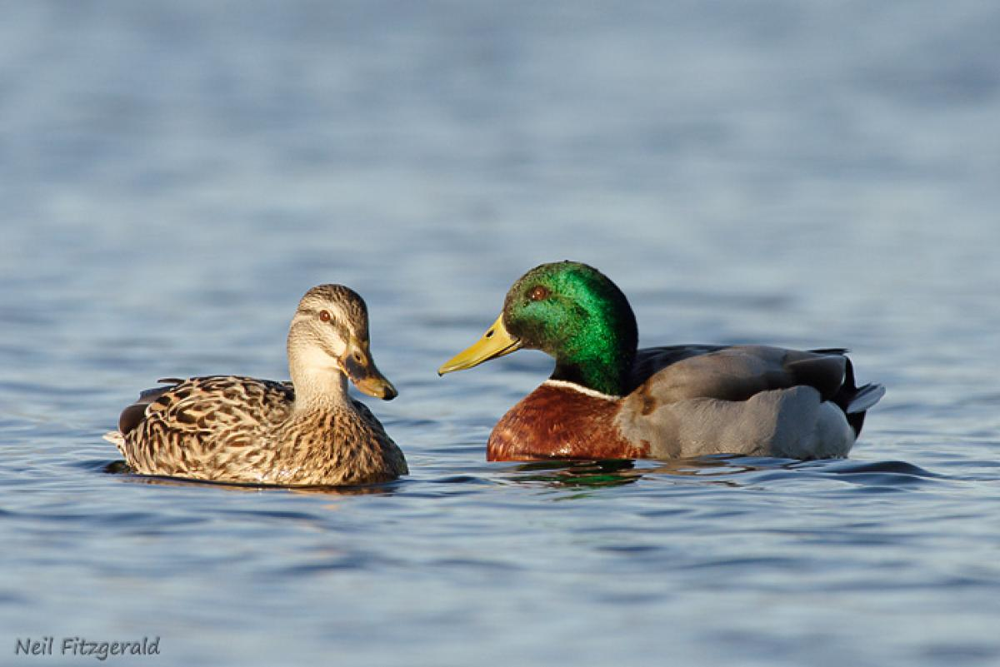

## Intrasexual selection is the battleground for mating

 
 
 

* **Occurs among males in many species**
    + Direct combat
    + Subtle compat
    + Display (rituals and colors)

 

* **Drives the evolution of secondary sexual characteristics**
    + between makes and females

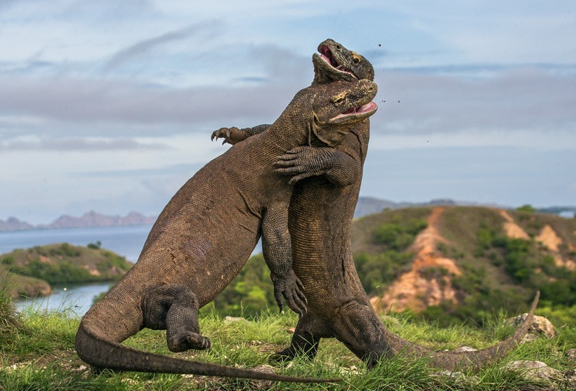

## Direct Combat: Stage beetles (Goyens et al. 2016)

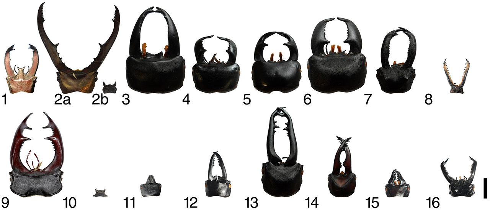

## Subtle combat

 
 
 
 

* **Often post-copulatory sperm competition**

 

* **Common in insects**
    + Piskin and Koskin 2010

 

* **Common in birds**

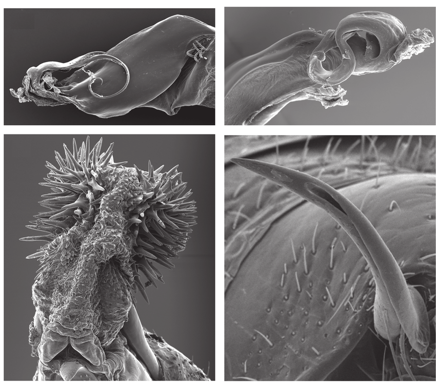

## Subtle combat

 
 
 
 

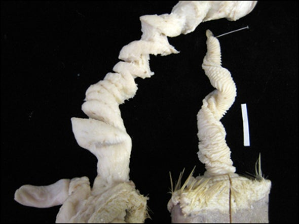

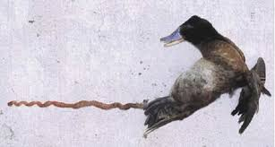

## Male display 

<iframe width="560" height="315" src="https://www.youtube.com/embed/sKJfvdV4uHU" frameborder="0" allow="accelerometer; autoplay; encrypted-media; gyroscope; picture-in-picture" allowfullscreen></iframe>

## Why is there sexual dimorphism?

 
 

* **Why be choosy?**
    + what percentage is by chance?

 

* **Sexual	selection	results	in the	evolution	of	sexually	dimorphic	traits**
    + preferential mating
    + direct fitness benefit
    + indirect fitness benefit

 

* **Heterosexual conversation....for now**

## Female guppies prefer males with orange spots....Why?

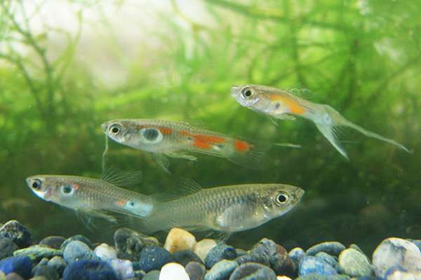

## Female blackbirds prefer males with orange beaks.. Why?

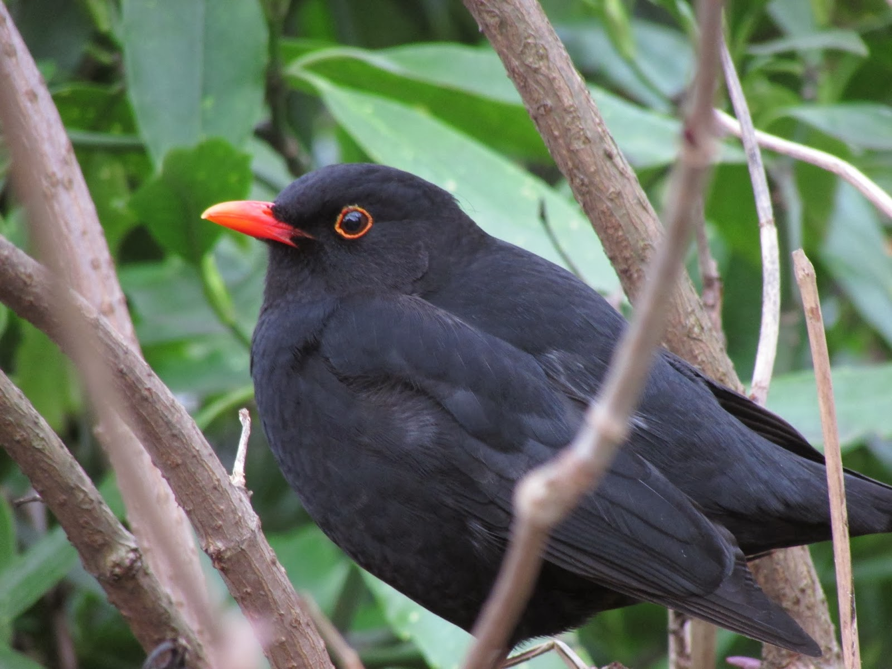

## Why do animals prefer symmetric partners? 

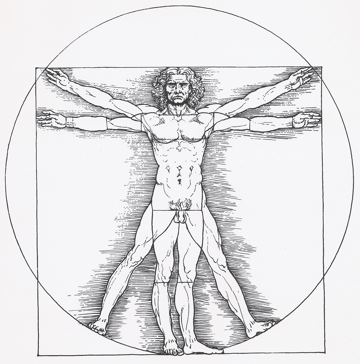

## Runaway selection

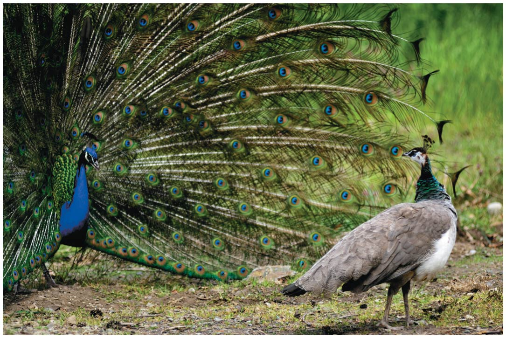

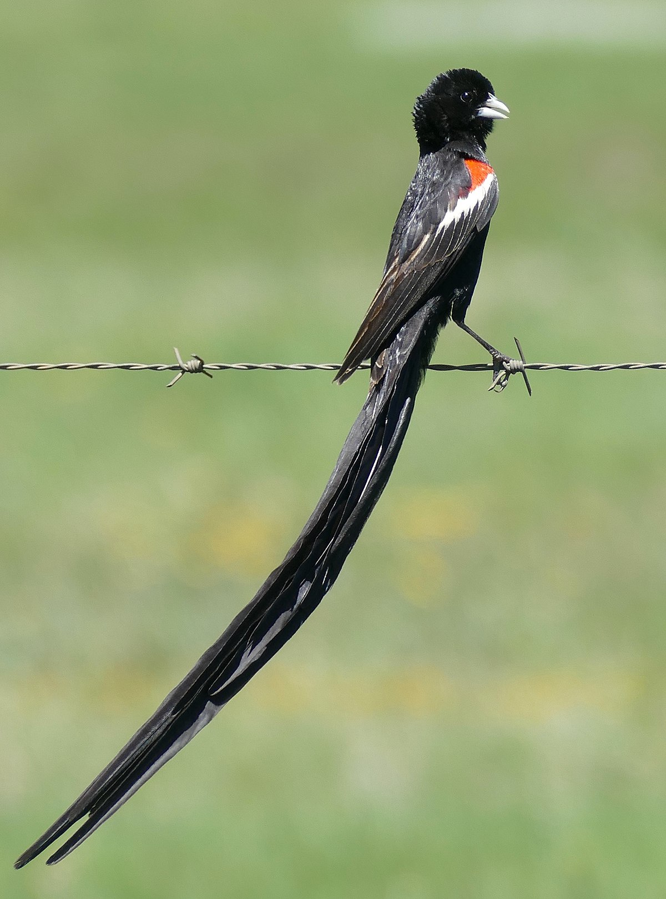

## Breaking the binary

 

* **Sex is not just heterosexual in animals**
    + ~2,000 species and counting....
    + dragonfly, dolphin, elephant, orca, turkey...

 

* **Gender binary doesn't exist in nature**
    + Multiple species with muliple genders
    + 6 different genders described 
    + sexual mimciry

 

* **Intersexual animals**
    + Female -> Male, Male -> Female
    + Female and male at same time

* **So is sexual selection a thing?**
    + more complicated than it seems on the surface

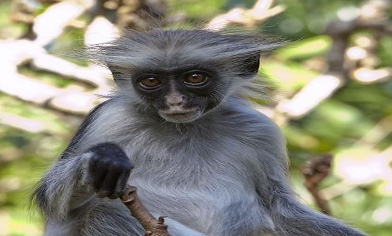
