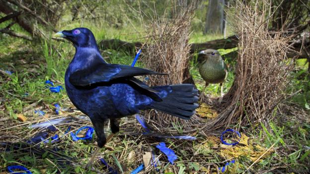
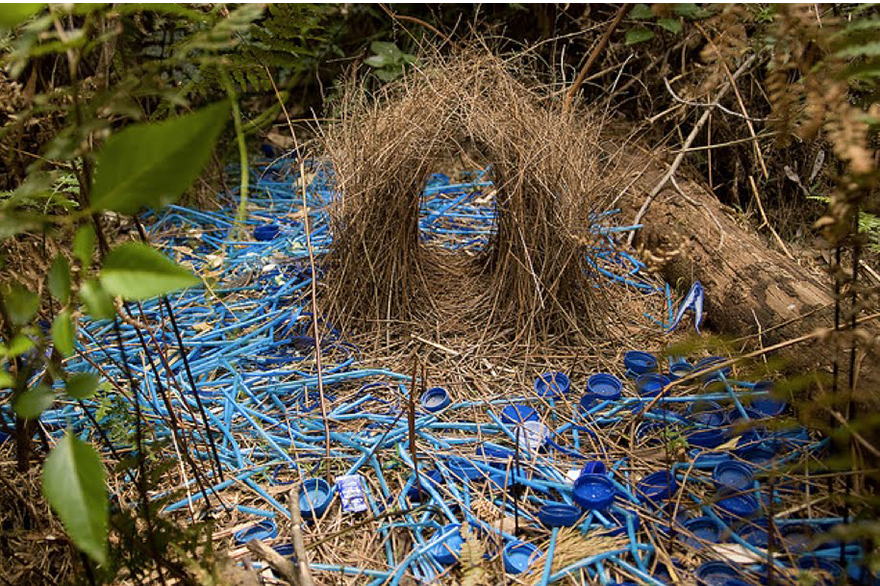
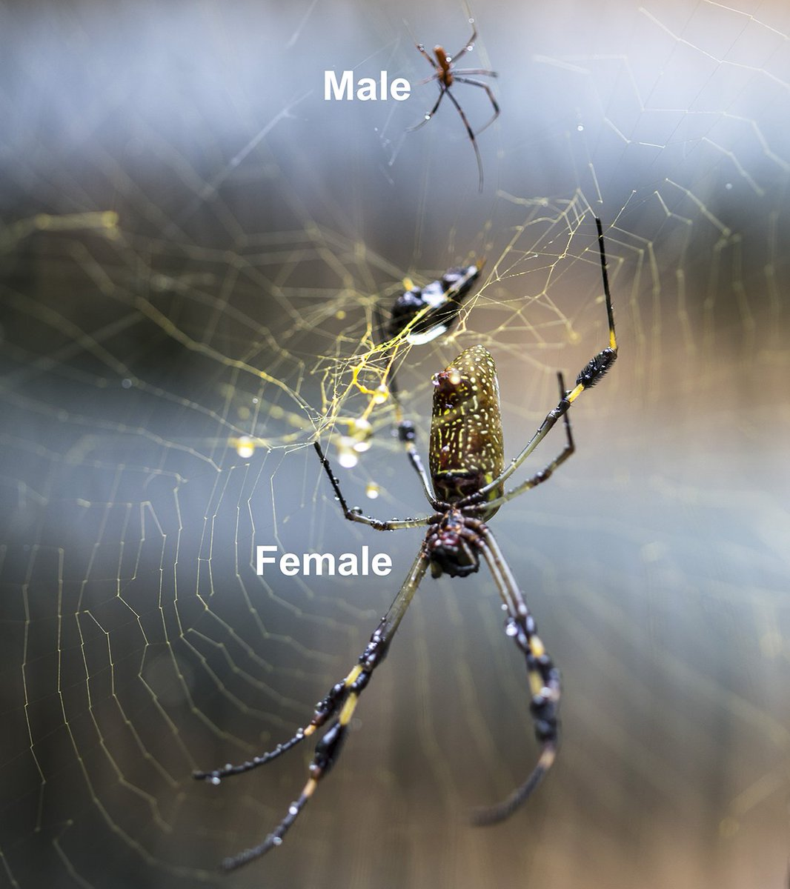
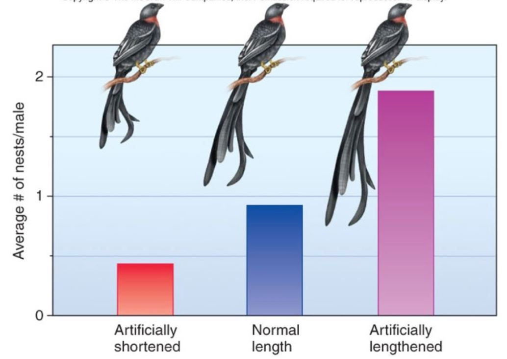

## Things to Know

 
 

#**Sexual Selection**

 
 

#**Mate Choice Benefits**

 
 

#**Sex Competition**

## Does having 'Good Genes' make you sexy?

 
 

* **Natural Selections rule #4:**
    + If variation in a heritable trait is associated with *variation in reproductive success*...
    + then advantageous traits will accumulate in a population

 

* **Brainstorm:** What traits might be associated with mating decisions between males and females in the animal kingdom?

 

* **Natural selection is *way* broader than you thought!**
    + Darwin proposed models of sexual selection

## Sexual selection is one kind of natural selection

 
 

* **Selection can occur as an association between phenotype and mating success**
    + *secondary* traits in mating
    + *Sexual Dimorphism* = males and females exhibit different traits
    
 

* **Introduces *choosiness* into evolution and reproduction**
    + 'mate choice'

 

* **Often: male 'showiness' in nature**
    + benefits and risks of showiness...

## Is this why males look and behave differently?

**What are these male traits 'expressing' to females?**
 
 
 
 
 
 
 
 
 
 
 
 
 
 
 
 
 

**If heritability > 0, then traits that increase reproductive success should accumulate**

## *Intrasexual selection* is the battleground for mating

 
 

* **'Choosiness' drives competition**
    + usually between males
    
 

* **Occurs in many species**
    + Direct combat
    + Subtle combat
    + Display (rituals and colors)

 

* **Drives the evolution of secondary sexual characteristics**

## Direct Combat: Stag beetles (Goyens et al. 2016)

## Subtle combat

 

* **Often post-copulatory sperm competition**
    + selection of diverse and elaborate male genitalia

 

* **Common in insects**
    + Piskin and Koskin 2010
* **Common in birds**

 

* **"Many bizarre traits, including male genitalia that explode during copulation, male genitalia that “sing” during copulation, potent seminal products that invade the female's body cavity and her nervous system to influence her behavior.... Eberhard 2009"**

## Subtle combat in Argentinian Wood Ducks

## Male displays and rituals (superb lyrebird)

<iframe width="560" height="315" src="https://www.youtube.com/embed/mSB71jNq-yQ" title="YouTube video player" frameborder="0" allow="accelerometer; autoplay; clipboard-write; encrypted-media; gyroscope; picture-in-picture; web-share" allowfullscreen></iframe>

## Male displays and rituals (birds of paradise)

<iframe width="560" height="315" src="https://www.youtube.com/embed/sKJfvdV4uHU" frameborder="0" allow="accelerometer; autoplay; encrypted-media; gyroscope; picture-in-picture" allowfullscreen></iframe>

## Male displays and rituals (widowbird)

<iframe width="560" height="315" src="https://www.youtube.com/embed/OPI-9oi19gQ" frameborder="0" allow="accelerometer; autoplay; encrypted-media; gyroscope; picture-in-picture" allowfullscreen></iframe>

## Male displays and rituals (satin bowerbirds)

## Male displays in birds....

 
 

https://www.youtube.com/watch?v=_Dq437HuhO0

 

https://www.youtube.com/watch?v=cLnbiTkj1TQ

 

https://www.youtube.com/watch?v=U89tw093s_Y

 

https://www.youtube.com/watch?v=XWjx6oSgC4M

 

https://www.youtube.com/watch?v=CQ1VQ-4LYAI

## Why is there sexual dimorphism?

 

* **How common is choosiness??**
    + in what species does preferential mating occur?
    
 

* **Why be choosy?**
    + what are the real rewards for the female?

 

* **What do	dimorphic	traits actually express to the opposite sex**
    + direct fitness benefit
    + indirect fitness benefit

 

* **Heterosexual conversation....for now**

## Female guppies prefer males with orange spots....Why?

## Female blackbirds prefer males with orange beaks.. Why?

## Brainstorm: Why do animals prefer symmetric partners? 

## Runaway sexual selection

<!--  -->

## Breaking the binary

* **Sex is not just heterosexual in animals**
    + ~1,500 species and counting....
    + dragonfly, dolphin, elephant, orcas, turkey...
    + beetles, sheep, bats, orangutans....
    + most present in social species
    + animals have collections of sexual behaviors

 

* **Gender binary doesn't exist in nature**
    + if gender exists in nature, it is very fluid
    + sexual mimicry & masking sexuality

 

* **Intersexual animals**
    + female -> male, male -> female
    + female and male at same time
    + male seahorses can get pregnant

* **So is sexual selection a thing?**
    + more complicated than it seems on the surface

