## Macroevolution

 
 
 

* **Review: microevolution happens at the population level**

 

* **Macroevolution: Speciation forms evolutionary independent populations**

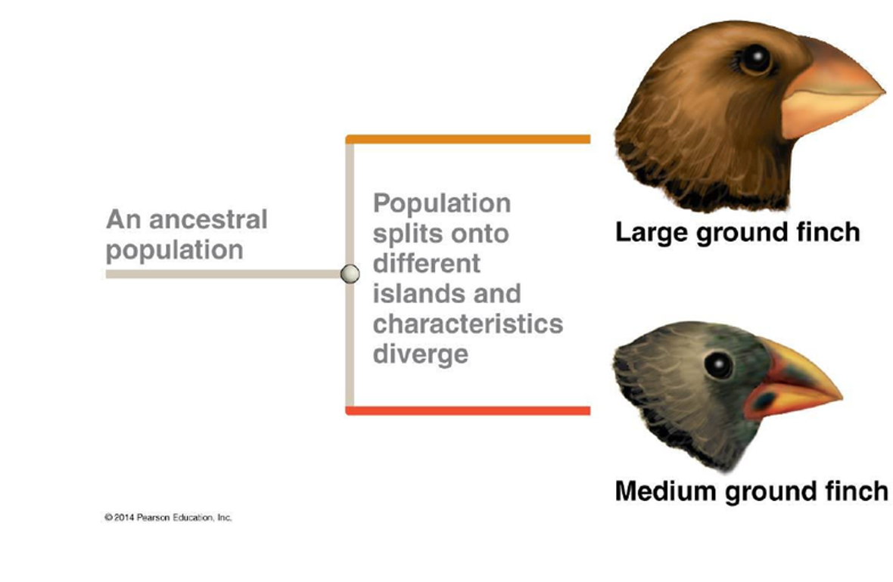

## Biological Species Concept

 

* **Reproductive isolation between populations results in a lack of gene flow**
    + gene flow: 
 

* **Individuals do not interbred with other populations or are unable to produce viable offspring after mating**

 
 

* **Members of a biological species are united by the potential ability to be reproductively compatable**

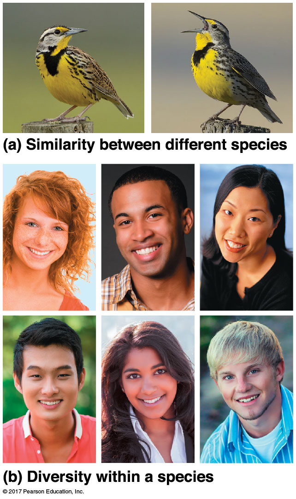

## Mechanisms of reproductive isolation? (Fig 24.3)

 

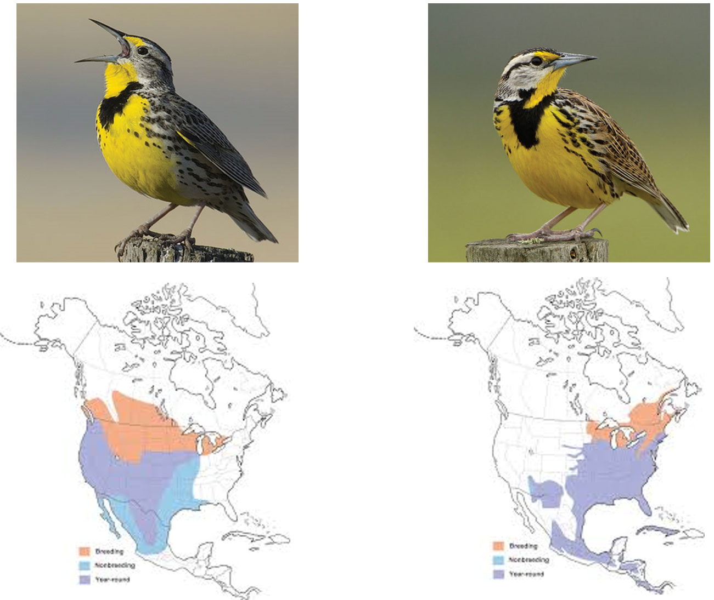

## Issues with the biological species concept

 

* **Fossils: How do we evaluate isolation?**

 

* **Asexual reporduction (single celled prokaryotes)**
    + Bdelloid Rotifers haven’t
reproduced sexually for > 80 million years 
    + An estimated 2000 species of asexual rotifers are known

 

* **Geopgraphic proximity: how do we know if they cant make babies?**

 

* **Distinct species still have gene flow: "grolar bear"**

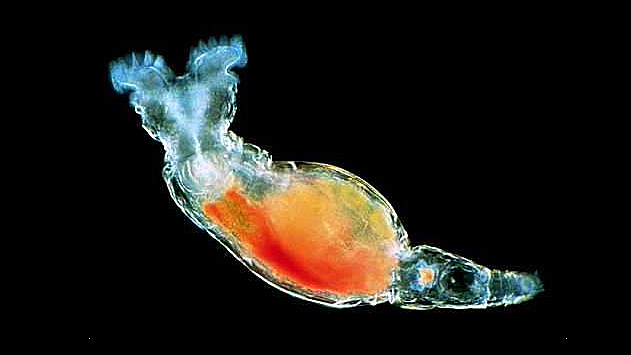

## Alternate species concepts: morphological

## Alternate species concepts: morphological

 

* **Can do with all organisms but: What kinds of traits & how many?**

 

* **Species can change their form: Polymorphisms**

 

* **Cryptic species that do not differ in morphology (e.g., fossil shells)**

 

* **Subjective to the scientist!**

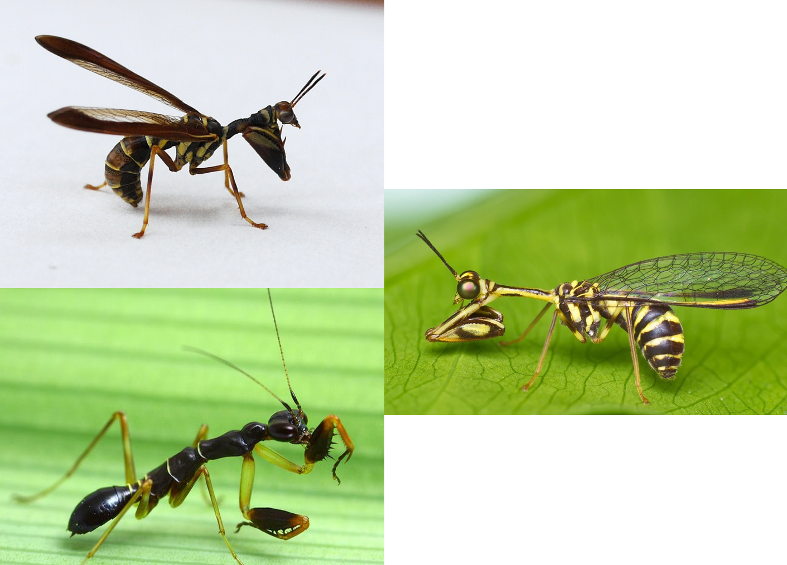

<!-- ## Alternate species concepts: phylogenetic  -->
<!-- 
 -->

<!-- 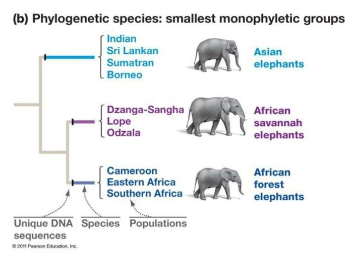 -->

## How new species arise: Allopatry

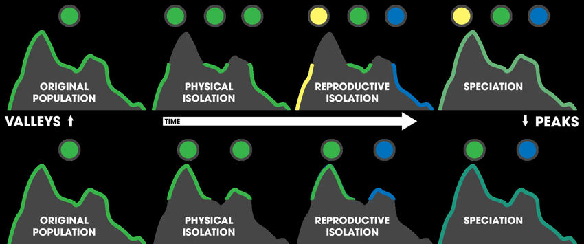

## Allopatric speciation in shrimp

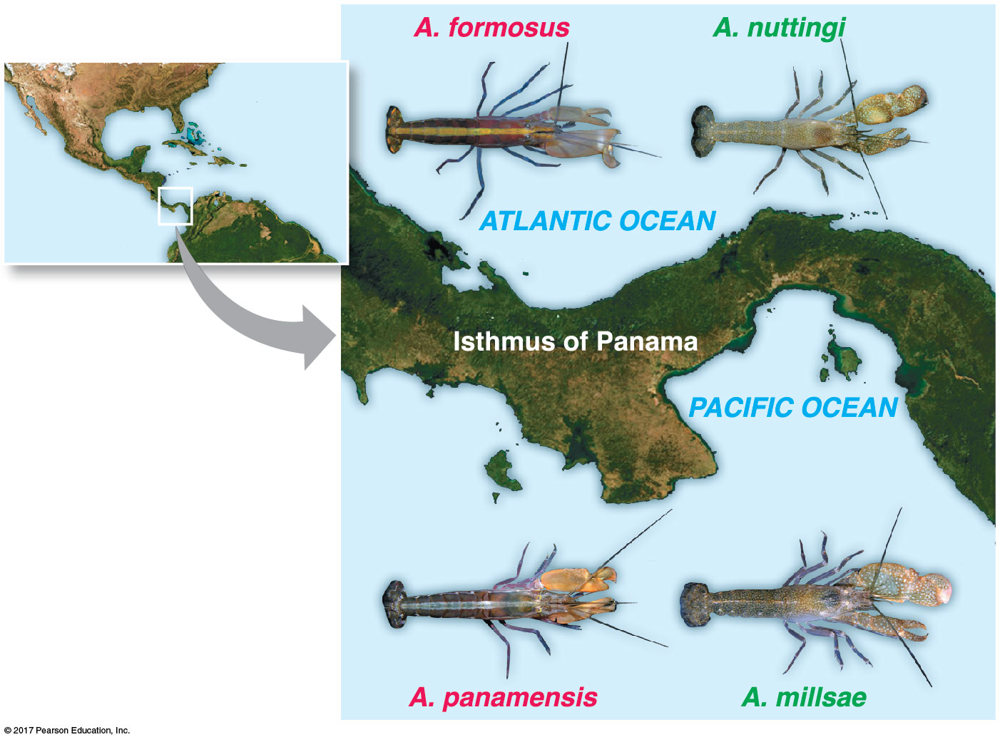

## How new species arise: Sympatry

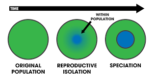

## Sympatric speciation via selection pressures

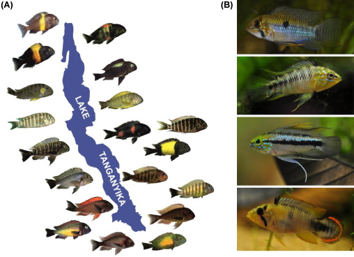

## Is speciation fast or slow? Fossils

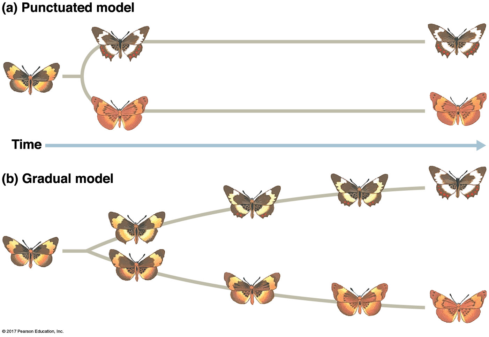

## How much genetic change does it take?

* **Three spine stickleback fish rapdidly evolve**
    + moved from oceans to freshwater when glaciers retreated

 

* **Freshwater habitats brought new selection pressures**
    + variety of habitats
    + new resources
    + change in competition

 

* **Molecular biology examined each speciation**
    + ocean -> fresh: one gene with bony armor plate
    + fresh habirats -> many genes based on selection pressures

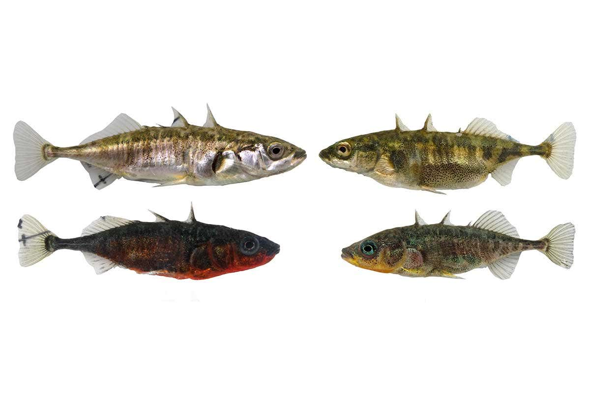
