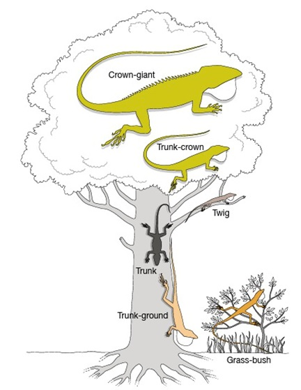
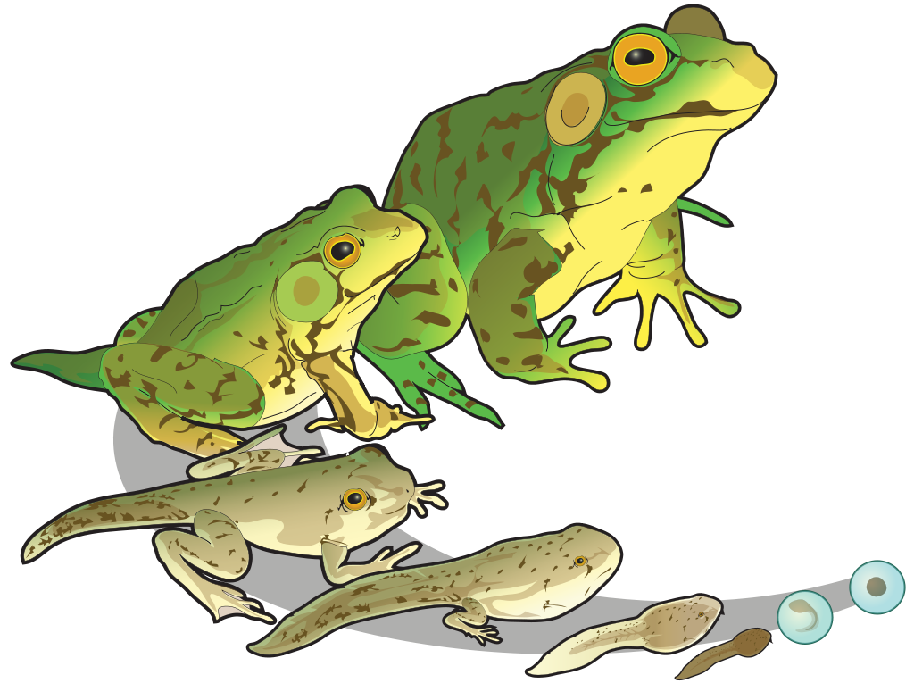
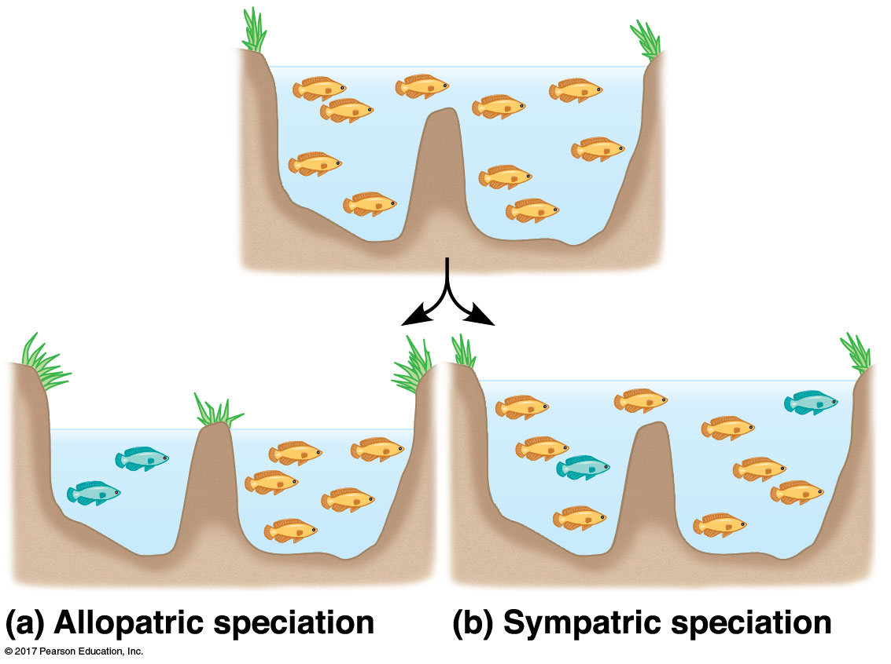

## Things to Know (#'s)

 

**# Species Concepts (3)**
 

**Snow day guide: Write out the criteria for each concept, then write out one flaw**

 

**# Barriers to Mating**
 

**Snow day guide: This is an extension of the biological species concept. Focus on being able to recognize/write out scenarios that prevent mating from occurring (pre-zygotic = habitat, temporal, behavioral, and mechanical isolation)**

 

**#Allopatry vs Sympatry**
 

**Snow day guide: These are two 'mechanisms' by which species *actually* form (different from above). Be able to recognize/write out scenarios that would form new species for each**

## Macroevolution

 
 
 
 

* **Microevolution happens at the population level (natural selection, genetic drift, gene flow)**

 

* **Macroevolution: *Speciation* events form evolutionary independent populations**

 

* **New species are the bridge between evolution within a population and larger patterns in evolution, such as new taxonomic groups**

## How/Why species form: The limits of human cognition

## What actually is a "Species"?

 
 
 
 
 
 

* **Textbooks: A group of populations whose members have the *potential to interbreed* in nature and produce viable offspring**

## What actually is a "Species"?

 
 
 
 
 
 

* **Textbooks: A group of populations whose members have the *potential to interbreed* in nature and produce viable offspring**

## Biological Species Concept: Unity of reproduction

 

* **Reproductive isolation between populations results in a lack of gene flow**
    + what are the consequences of no gene flow? 
    
 

* **Individuals do not interbred with other populations or are unable to produce viable offspring after mating**
    + via pre- and post-zygotic barriers
        + prevent mating (pre) or prevent viable offspring (post)

 

* **BSC: Members of a biological speci es are united by the potential ability to be reproductively compatible**

## 

## Mechanisms of reproductive isolation in Meadowlarks

 

## Issues with the biological species concept

 
 

* **How do we effectively evaluate isolation?**
    + Is this even possible do to in fossils?

 

* **Geographic proximity: how do we know if they cant make babies?**

 

* **Asexual reproduction is unaccounted for...**
    + *Belloid* rotifers haven’t
reproduced sexually for > 80 million years 
    + An estimated 2000 species of asexual rotifers are known

## Morphological Species Concept: Unity of body plans

**MSC: defines a species based on groups of physical traits that are unique to each species**
 
**MSC: no issues with fossils or reproductive type**

## Issues with the morphological species concept

 
 
 

* **Applies to all organisms but.... what kinds of traits & how many?**
    + Subjective to the scientist!
    
 

* **Species can change their form: Polymorphisms**

 

* **Cryptic species that do not differ in morphology**
    + lots of mimics in nature!

## Ecological species concept: Unity of Niche

 
 
 

* **ESC: defines a species in terms of its ecological niche**
    + *Niche = sum of how members of the species interact with the nonliving and living parts of their environment*
    + living map of the habitat + other species interactions any species requires

 

* **Key idea: members of the same species occupy the same niche and are shaped by the same selection pressures**
    + different species would occupy different niches
    + any new species should have a 'new niche' compared to its ancestor
    

## Issues with the ecological species concept

  
 

* **Niches can overlap or shift = niche boundaries can be fuzzy**
    + many forest birds both eat the same insects in the same trees
    + a fish species may eat insects in streams but switch to zooplankton in lakes

 

* **Humans define a species' niche based on 'X' factors they can measure**
    + more/less factors can redefine the niche

 

* **One species can occupy multiple niches across life stages or environments—making boundaries fuzzy**
    + tadpole & adult frog have different niches
 
 

 

    
<!-- ## Lineage Species Concept: Unity of ancestry -->
<!-- 
 -->
<!-- **LSC uses genetic similarity/differences based on ancestry to determine species but is subjective in the magnitude of differences needed.** -->
<!--  -->

<!--  -->

## How new species form: Allopatry

**Allopatric speciation: the formation of new species due to geographic (physical) isolation that stops gene flow between populations**

## Allopatric speciation in Hawaiian fruit flies

**Hawaiian islands form through time. Fruit flies from one population migrate to a new island (physical separation) and have formed many new species.**

<!--## Allopatric speciation in shrimp

**The Atlantic and Pacific oceans used to connect before what we call Panama arose from the ocean. Different shrimp species live at different depths (colors on the picture). As Panama split the ocean these populations (by depth) became isolated and formed different species. The deep species (red) on opposite sides are more different than shallow species (green) because they have been separated longer!!** 
 -->

## How new species form: Sympatry

**Sympatric speciation: the process by which new species evolve from a single ancestral population while inhabiting the same geographic location**

<!-- ## Sympatric speciation via selection pressures: Lake Victoria -->
<!-- 
 -->

<!-- -->

## Sympatry in Hawthorn and apple flies

<!-- ## Is speciation fast or slow? -->
<!-- 
 -->

<!--  -->

<!-- <!-- ## What factors impact speciation rates? --> 
<!-- <!-- 
 --> 

<!-- <!--  --> -

## How much genetic change does it take to form a new species?

 

* **Three spine stickleback fish rapidly evolve**
    + moved from oceans to freshwater when glaciers retreated after last ice age

 

* **Freshwater habitats brought new selection pressures**
    + variety of habitats
    + new resources
    + change in competition

 

* **Molecular biology examined each speciation**
    + ocean &rarr; fresh: one gene with bony armor plate
    + fresh habitats &rarr; many genes based on selection pressures

## Study aid: The geography of speciation

**The pre- and postzygotic barriers can form for either type of speciation**

