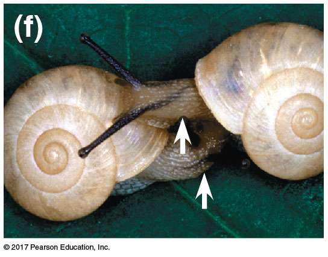

## Macroevolution

 
 
 
 

* **Microevolution happens at the population level (review)**

 

* **Macroevolution: Speciation events form evolutionary independent populations**
    + and new taxonomic groups

 

* **New species are the bridge between evolution within a population and large patterns in evolution**

## How/Why species form: The limits of human cognition

## What actually is a "Species"?

 
 
 
 
 
 

* **Textbooks: A group of populations whose members have the *potential to interbreed* in nature and produce viable offspring**

## What actually is a "Species"?

 
 
 
 
 
 

* **Textbooks: A group of populations whose members have the potential to interbreed in nature and produce viable offspring**

## Biological Species Concept: Unity of reproduction

 

* **Reproductive isolation between populations results in a lack of gene flow**
    + gene flow: 
    
 

* **Individuals do not interbred with other populations or are unable to produce viable offspring after mating**
    + pre- and post-zygotic

 

* **BSC: Members of a biological species are united by the potential ability to be reproductively compatible**

## 

## Mechanisms of reproductive isolation? (Fig 24.3)

 

## Issues with the biological species concept

 
 

* **How do we effectively evaluate isolation?**
    + Is this even possible in fossils?

 

* **Geographic proximity: how do we know if they cant make babies?**

 

* **Asexual reproduction**
    + *Belloid* rotifers haven’t
reproduced sexually for > 80 million years 
    + An estimated 2000 species of asexual rotifers are known

## Morphological Species Concept: Unity of body plans

## Issues with the morphological species concept

 
 
 

* **Applies to all organisms but.... what kinds of traits & how many?**
    + Subjective to the scientist!
    
 

* **Species can change their form: Polymorphisms**

 

* **Cryptic species that do not differ in morphology**
    + lots of mimics in nature!

## Phylogenetic Species Concept: Unity of ancestry

## How new species arise: Allopatry

## Allopatric speciation in Hawaiian fruit flies

## Allopatric speciation in shrimp

## How new species arise: Sympatry

<!-- ## Sympatric speciation via selection pressures: Lake Victoria -->
<!-- 
 -->

<!--  -->

## Sympatry in Hawthorn and apple flies

<!-- ## Is speciation fast or slow? -->
<!-- 
 -->

<!--  -->

<!-- <!-- ## What factors impact speciation rates? --> -->
<!-- <!-- 
 --> -->

<!-- <!--  --> -->

<!-- ## How much genetic change does it take? -->
<!-- 
 -->

<!-- 
 -->

<!-- * **Three spine stickleback fish rapidly evolve** -->
<!--     + moved from oceans to freshwater when glaciers retreated -->

<!--   -->

<!-- * **Freshwater habitats brought new selection pressures** -->
<!--     + variety of habitats -->
<!--     + new resources -->
<!--     + change in competition -->

<!--   -->

<!-- * **Molecular biology examined each speciation** -->
<!--     + ocean &rarr; fresh: one gene with bony armor plate -->
<!--     + fresh habitats &rarr; many genes based on selection pressures -->
<!-- 
 -->

<!--  -->
