## Things to Know

 

**#Vascular Plants/Traits**

 
 
 

**#Homospory vs Heterospory**

 
 
 

**#Plant Phylogeny**

## First plant group: non-vascular bryophytes (mosses)

 

* **Mosses, hornworts and liverworts**
    + Fossils of bryophyte spores ~470mya
    
 

* **Non-vascular; ground hugging carpets**
    + bodies to thin to support height growth

 

* **Have a rhizoid but not a root**
    + anchors plant
    + does not uptake water

 

* **Very resistant spores**

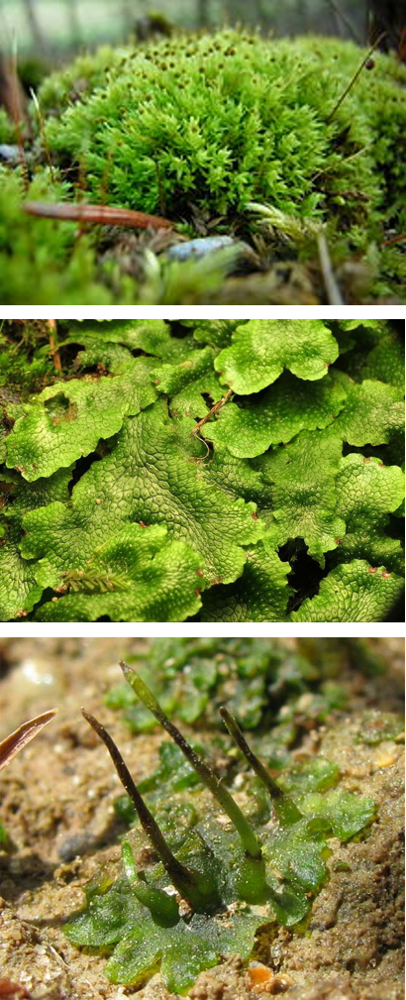

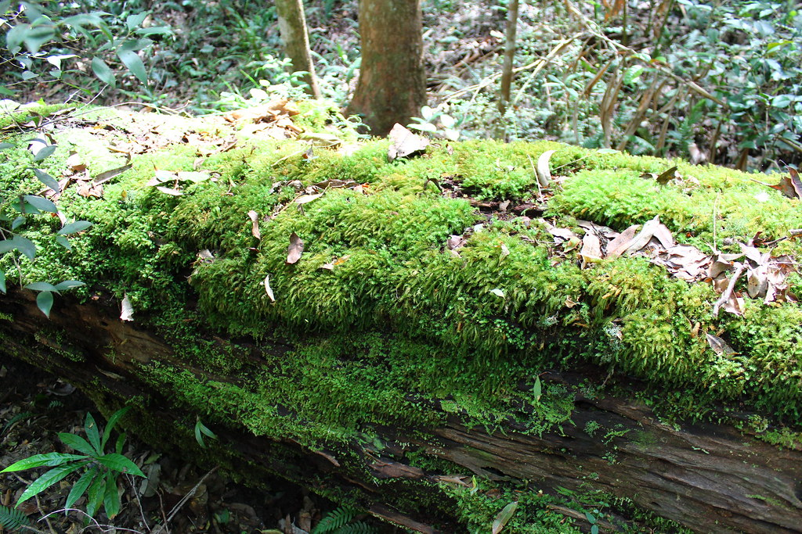

## Bryophytes have a gametophyte dominated life cycle

**Early plants, like moss, have sperm that swim from antheridia to archegonia (need water)**

## Mosses, homosporous AoG with gametophyte dominance

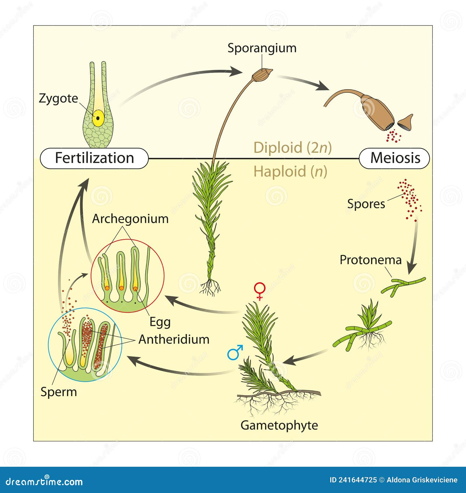

## Vascular plants were the next evolutionary step...Why?

 **Vascular tissues: tissues for conducting nutrients and fluid internally**

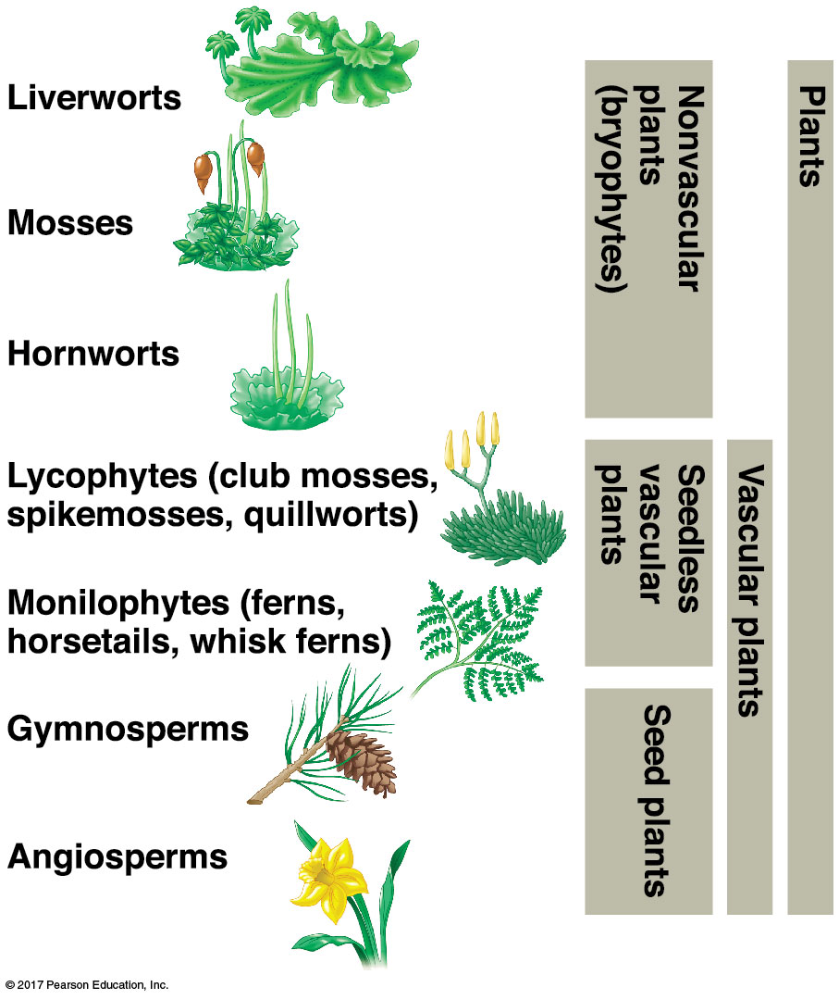

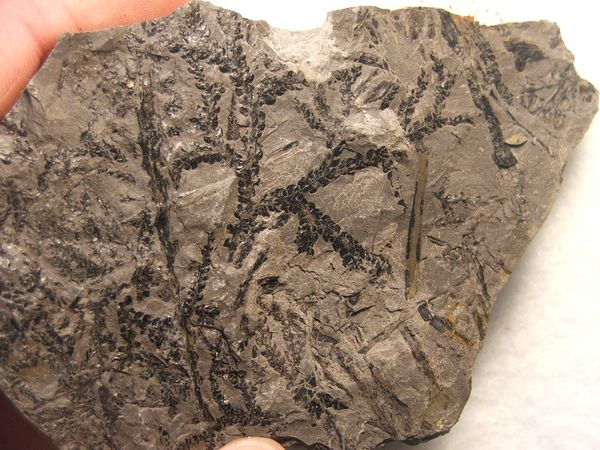

<!-- ## The Devonian Period: First forests were lycophytes and ferns -->
<!-- 
 -->

<!-- 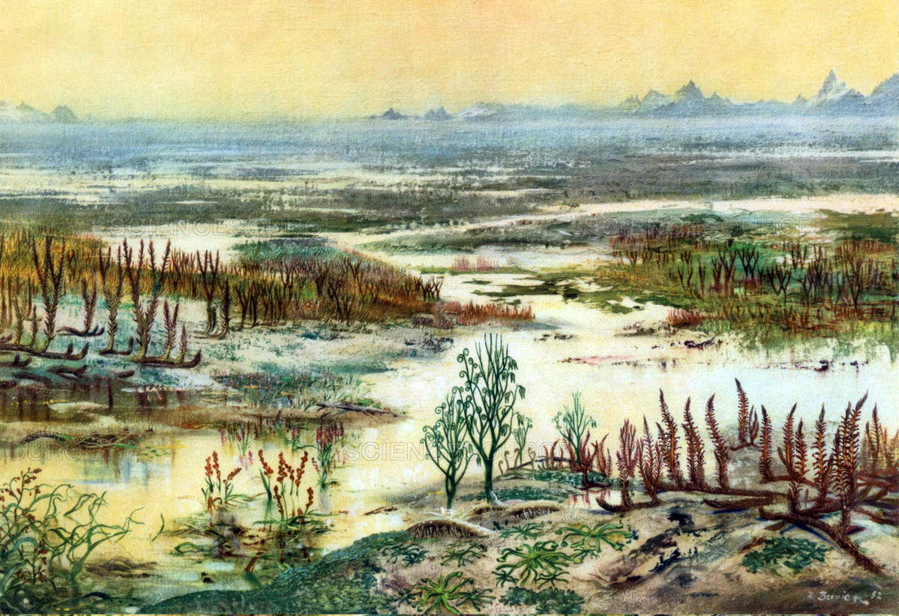 -->

## The big picture: Vascular plants now dominate Earth

 

* **Bryophytes ruled for <100 million years**
    + vascular plants show up ~425mya

 

* **Plants then evolved vascular tissues**
    + light competition = selection pressure
    + tissues connected leaves to roots
    
 

* **First vascular plants lacked seeds**
    + sperm still needed water to swim 
    + lycophytes and ferns = 1^st^ groups

 

* **Fern and lycophyte diversity now diminished**
    

## Ancient seedless forests now power our planet: Coal!

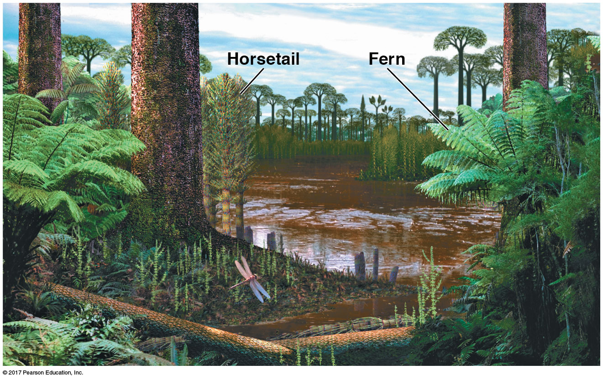

## Vascular system: the basics (add to phylogeny)

 

** Xylem	=	water	conducting	cells (one	way)**
 
** Phloem	=	sugar sap conducting cells (multi-directional)**

 

* **Conducting cells also provide *biomechanical* support**
    + *lignin* in cell walls
    + does not rot easily
    + does not collapse easily
    + 'think' bundles of rigid pipes
    + *allows plants to grow vertically*
    
 

* **Vascular tissues move liquid under tension**

 

* **Vascular tissues evolved independently several times**

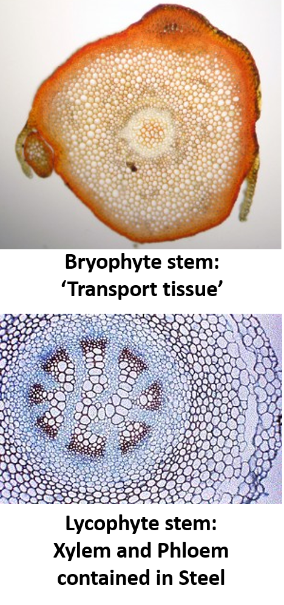

## 

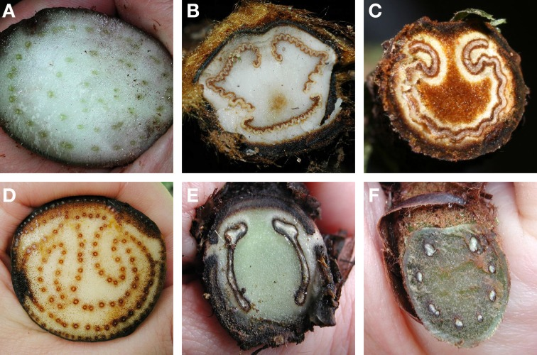

<!-- ## -->
<!--   -->
<!--   -->
<!--   -->
<!--   -->
<!--   -->
<!--   -->
<!--   -->
<!--   -->

<!-- 
 -->

<!-- **Vascular elements evolved independently several times** -->
<!-- 
 -->

<!-- 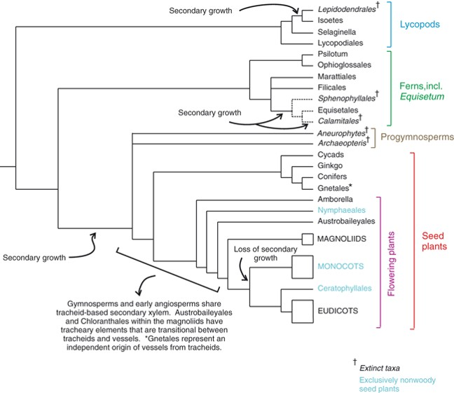 -->

## Evolution of roots (add to phylogeny)

* **Vascular tissues belowground**
    + extension of ancient stems
    + bryophytes have no 'true' roots

 

* **Absorb water and nutrients**
    + active explorers of soil
    + most elements for plant growth are in soil
    + often in symbiosis with fungi

 

* **Anchor the plant in place**
    + support vertical growth

 

* **Fossils show roots in lycophytes ~ 400mya**
    + convergent evolution in ferns

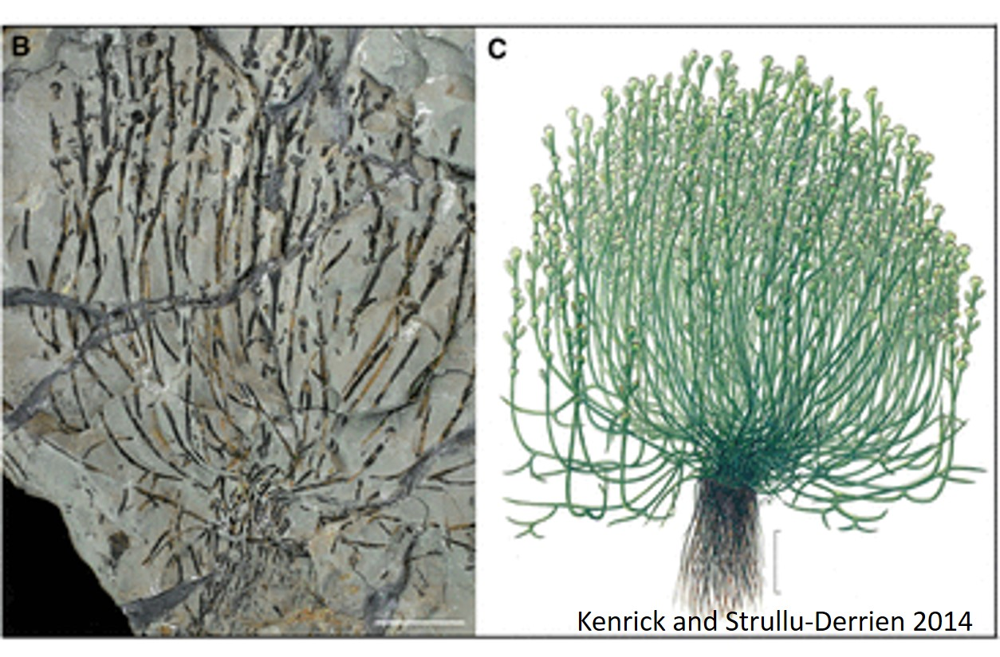

## Evolution of leaves (add to phylogeny)

 

* **Photosynthetic organ on plants**
    + shape generally maximizes surface area exposed to sunlight

 

* **Microphylls: leaves with single unbranched vein**
    + *vein*: leaf structure containing xylem + phloem
    + unique to lycophytes (add to phylogeny)
 
 

* **Megaphylls: leaves with many branched veins**
    + majority of vascular plants (add to phylogeny)
  
 

* **Why do more veins matter?** 

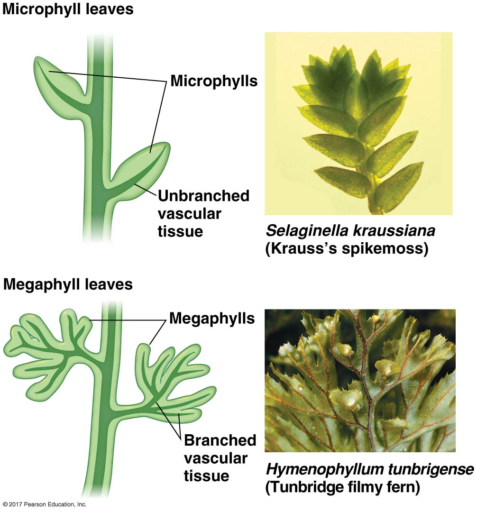

## Evolution of leaves: Sporangium

* **Sporophyll: modified leaf with sporangium**
    + 'fertile' leaf (w/ spores)

 

* **Sporangium:  spore container (*house*)**
    + ferns: clusters of sporagnia called '*sori*'
    + lycophytes: '*stobilus*' holds many sporagnia (like a cone)
    + angiosperms: structures inside of flowers
    + exception - moss have sporangia but not leaves

 

* **Spore mother cell: cell inside sporagnium**
    + diplod cell (2N) undergoes meiosis to make a spore (1N)

 

* **What is the ploidy of each cell type in this picture?**

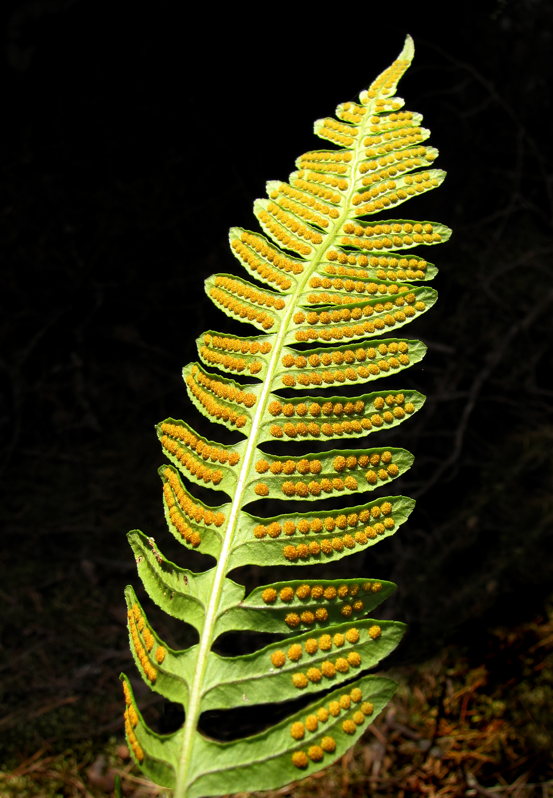

## Seedless vascular plants have free living separate generations

 

* **Sporophyte: The fern you see in the woods**
    + now the dominant stage of the lifecycle

 

* **Gametophye: independent haploid generation**
    + start out female or bisexual

 

* **Dependent embryo (2N) develops and replaces gametophyte**
    + in moss, sporophyte develops and dies on the living gametophyte
    
 

* **What	does natural selection favor diploid dominant	lifecycles?**

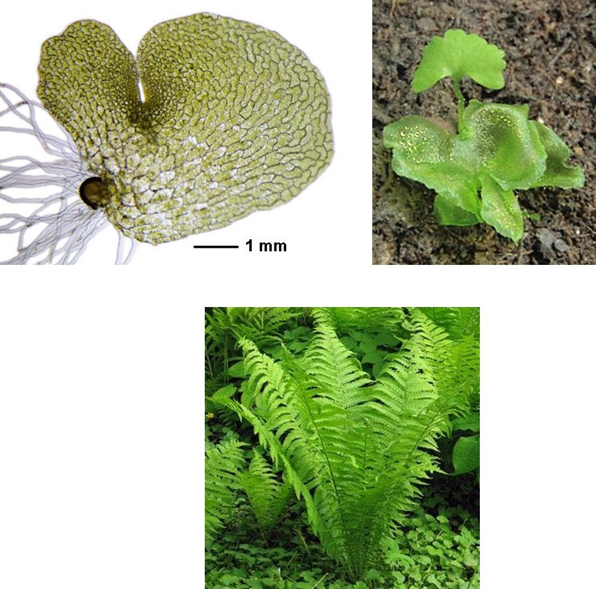

## Homosphorous life cycle (mostly) with dominant sporophytes

**Sporophytes are larger and long lived, gametophytes are smaller and shorter lived, each spore produces a bisexual gametophyte**
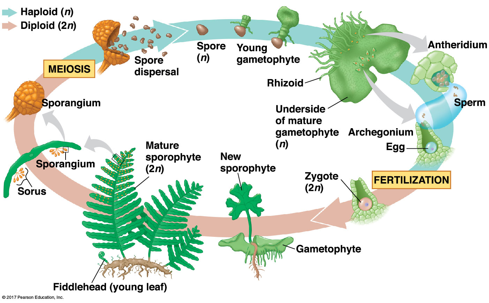

## Lycophytes: First vascular plants

 
 

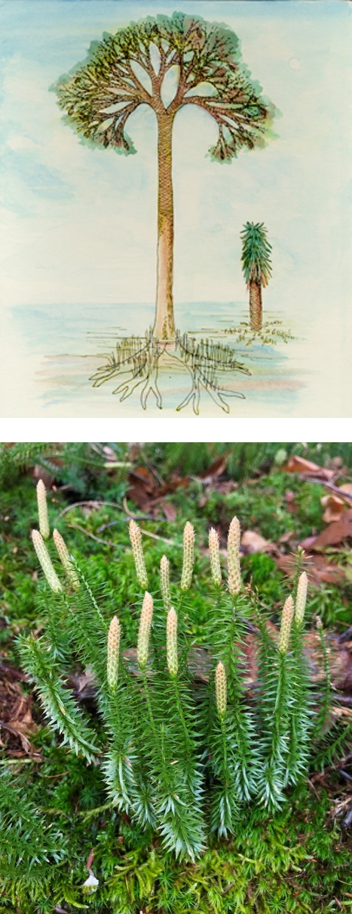

* **Independent,	branched	sporophyte**

 

* **Lignified	vascular	tissue,	tracheids & roots**
    + *tracheid* = long, twisted xylem cell

 

* **Leaves are microphylls**
    + fertile leaves have	strobili (spore house)

 

* **Some	with	heterospory	(*Selaginella* spp)**
    + male (micro-) and female (mega-) spores
    + male (micro-) and female (mega-) gametophytes

## Ferns

 

* **Whisk Ferns, Equisetum & Ferns**
    + mostly homosporous
    
 

* **Homospory = spores that germinate to produce bisexual (both male and female) gametophytes**
    
 

* **Leaves are mostly megaphylls**
    + whisk ferns lost leaves
    + Equistem has reduced megaphylls (tiny leaves)
    

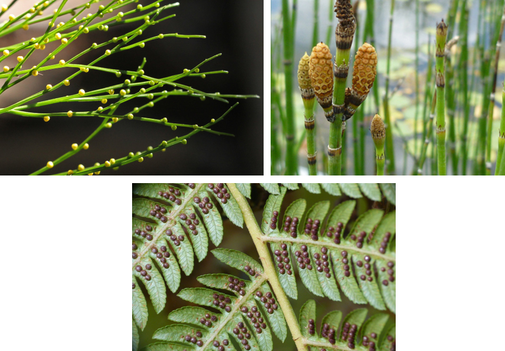

## Ferns

 

* **Whisk Ferns, Equisetum & Ferns**
    + mostly homosporous
    + whisk ferns do not have roots
    
 

* **Leaves are mostly megaphylls**
    + whisk ferns lost leaves
    + Equistem has reduced leaves

  

* **New *Gaga* genus with 19 species**
    + “We wanted to name this genus for Lady Gaga because of her fervent defense of equality and individual expression” Pryer @ Duke University
    

## 

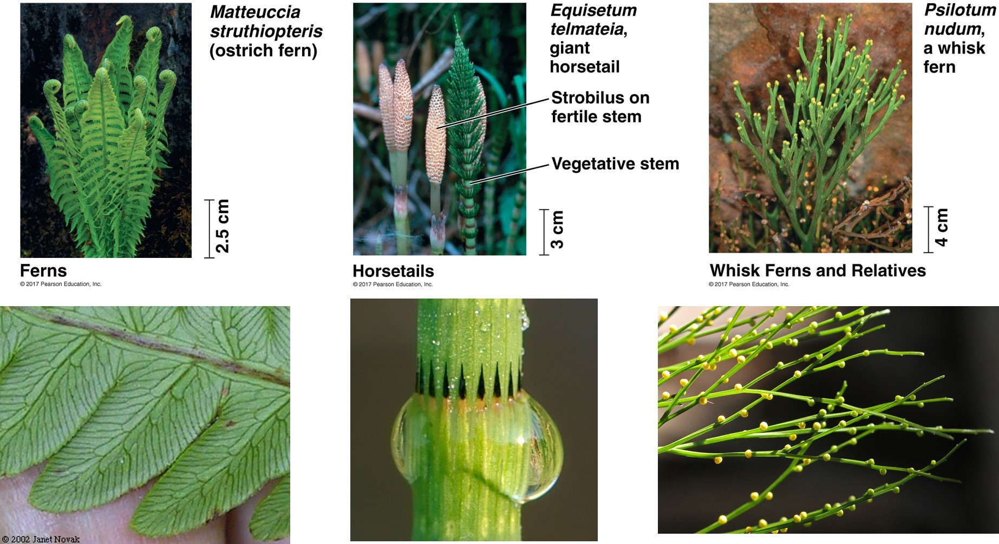

## The consequences of homospory

 
 

* **One	spore	&rarr; one	gametophyte	&rarr; bisexual gametophyte**
    + everything is haploid (1N)

 

* **Produces	both	sperm	and	egg	via mitosis from haploid cells**
    + sperm must swim to the egg

 

* **A lot of self fertilization**
    + what is good/bad about this?
    

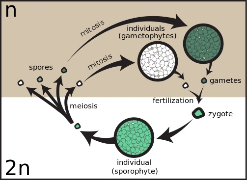

## How ferns avoid self-fertilization...

 

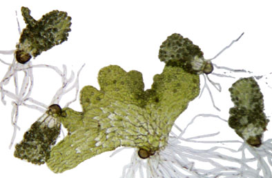

* **Fastest developing gametophyte (female) releases chemical hormone**

 

* **Hormone turns other developing gametophytes all male**
    + sperm from everywhere!
    + female power - makes her own boyfriends

 

* **Archegonia (F) and Antheridia (M) can also develop at different times**
    + if fertilization doesn't happen, female gametophyte becomes bisexual

