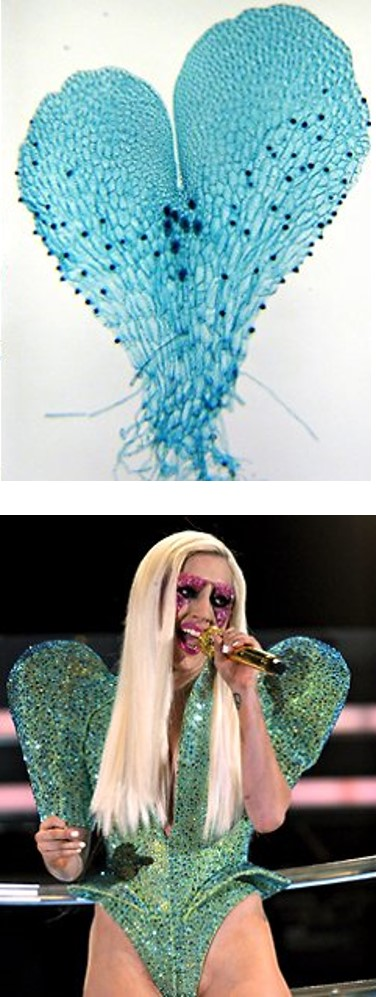

## Vascular plants were the next evolutionary step

## The big picture: Vascular plants now dominate Earth

 
 

* **Bryophytes ruled for <100 million years**
    + vascular plants show up ~425mya

 

* **Developed a vascular system**
    + grow taller than bryophytes
    + leaves & roots
    
 

* **First vascular plants lacked seeds**
    + sperm still needed to swim 
    + ferns and lycophytes
    

## Give thanks to extinct seedless vascular plants: Coal

## Vascular system: the basics

 
 
 

* **Xylem	=	water	conducting	(one	way)**	

 

* **Phloem	=	sugar conducting (multi-directional)**	

 

* **Conducting cells evolved structural support**
    + *lignin* in cell walls
    + does not rot easily
    + does not collapse easily
    + think bundles of rigid straws or pipes

## 

##
 
 
 
 
 
 
 
 

**Vascular elements evolved independently several times**

## Evolution of roots

 

* **Vascular tissues belowground**
    + bryophytes have no 'true' roots

 

* **Absorb water and nutrients**
    + explore

 

* **Anchor the plant in place**
    + support vertical growth

 

* **Fossils show roots in lycophytes ~ 400mya**
    + convergent evolution?

## Evolution of leaves

 
 

* **Photosynthetic organ on plants**

 

* **Microphylls: single unbranched vein**
    + unique to lycophytes

 

* **Megaphylls: leaves with branched veins**
    + almost all existing plants
  
 

* **Why does this matter?** 

## Evolution of leaves: sporophylls

 

* **Sporophyll: modified leaf with sporangium**
    + vastly different looks
    + *Trophophyll*: vegetative leaf

 

* **Sporagnium:  spore container**
    + ferns: clusters of sporagnia called 'sori'
    + lycophytes: stobilus holds many sporogania (like a cone)

 

* **Spore mother cell: cell inside sporagnium**
    + undergoes meiosis to make spores

 

* **What is the ploidy of each cell type?**

## Lycophytes: First vascular plants

 
 

* **Independent,	branched	sporophyte**

 

* **Lignified	vascular	tissue,	tracheids & roots**
    + *tracheid* = special xylem cell

 

* **Leaves are microphylls**
    + Some	with	strobili	(evolved	multiple times)

 

* **Some	with	heterospory	(*Selaginella/Isoetes*)**

## Ferns

 

* **Whisk Ferns, Equisetum & Ferns**
    + mostly homosporous
    
 

* **Leaves are megaphylls**
    + whisk ferns lost leaf (enation)
    + Equistem has simplified megaphylls

  

* **New *Gaga* genus with 19 species**
    + “We wanted to name this genus for Lady Gaga because of her fervent defense of equality and individual expression” Pryer @ Duke University
    

## 

## Homosphorous life cycle (mostly) with dominant sporophytes

## The consequences of homospory

 
 
 

* **One	spore	&rarr; one	gametophyte	&rarr; bisexual gametophyte**
    + everything is haploid (1N)

 

* **Produces	both	sperm	and	egg	via mitosis**

 

* **A lot of self fertilization**
    + What is good/bad about this?

## How spore bearing plants avoid self-fertilization...

 
 
 

* **Turn other gametophytes male**
    + sperm from everywhere!

 

* **Archegonia (F) and Antheridia (M) mature at different times**

## Seedless vascular plants have free living separate generations

 

* **Sporophyte: The fern you see in the woods**
    + dominant stage

 

* **Gametophye: independent haploid generation**
    + start out female or bisexual

 

* **Derived Trait - remember how a moss looks!**

 

* **What	does natural selection favor diploid dominant	lifecycles?**

