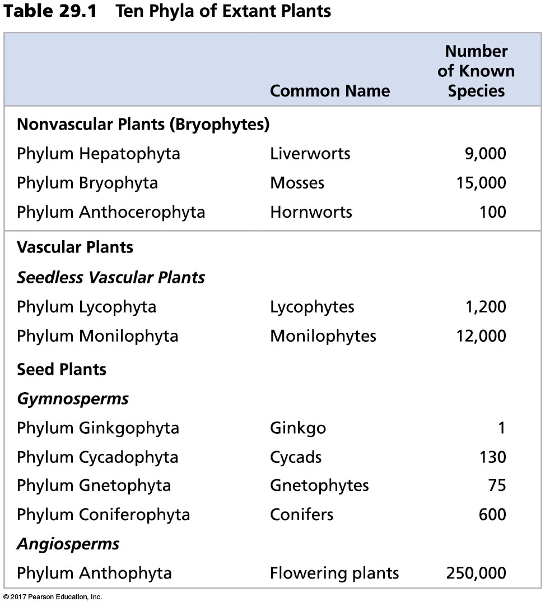

## Vascular plant were the next evoutionary step

## The big picture: Vascular plants now dominate Earth

 

* **Bryophytes ruled for ~100 million years**
    + vascular plants show up ~425mya

 

* **First vascular plants lacked seeds**
    + sperm still needed to swim 

 

* **Developed a vascular system**
    + now can frow taller than mosses
    

## Evolutionary history of vascular plants

* **Vascular elements evolved more than once**

## Lycophytes

* **Independent,	branched	sporophyte**	
* **Lignified	vascular	tissue,	tracheids,	roots**
* **Some	with	strobili	(evolved	multiple times)	
* **Some	with	heterospory	(evolved	multiple times)

## Ferns

## Give thanks to lycophytes and ferns: Coal

## Life cycle with dominant sporophytes

## Vascular system: the basics

Xylem	=	water	conduc6ng	(one	way)	
Phloem	=	sugar	et	al.	conduc6ng	(bidirec6onal)	

## Evolution of Roots

* **Vascular tissues belowground**
    + bryophytes have no 'true' roots

 

* **Absorb water and nutrients**
    + explore

 
* **Anchor the plant in place**
    + support vertical growth

 

* **Fossils show roots in lycophytes ~ 400mya**

## Evolution of leaves

* **Micropylls: single unbranched vein**
    + unique to lycophytes

 

* **Megaphylls: leaves with branched veins**
    + almost all existing plants
    + Why?

## Evolution of sporophylls

 

* **Trophophyll: vegetative leaf**

 

* **Sporophyll: modified leaf with sporangium**

 

* **Sporagnium:  spore container**
    + ferns: clusters of sporagnia called 'sori'
    + lycophytes: stobilus holds many sprogania (like a cone)
    
* **Spore mother cell: cell inside sporagnium**
    + undergoes meoisis to make spores (1N)

 

* **What is the ploidy of each of these?**

## The consequences of homospory

 

* **one	spore	&rarr; one	gametophyte	&rarr bisexual gametophyte**
    + remember everything is haploid (1N)

 

* **producing	bot	sperm	and	egg	mitotically**

 

* ** a lot of self fertilzation**

## Homosporous lifecycle (lycophytes and ferns)

Sporophyte	
Sporophyll
Sporangium	
Spore	Mother	Cell	
MEIOSIS	
Spore	
Gametophyte	
Archegonium
Antheridium	
Egg	
Sperm	
FERTILIZATION	
Zygote

## Seedless vascular plants have free living separate generations

 

* **Sporophyte: The fern you see everytime you walk in the woods**

 

* **Gametophye: independent haploid generation**
    + start out female or bisexual

 

* **Synapomorphy!!** - remember how a moss looks!**

 

* **What	selecive	pressures	might	favor	a	diploid	 dominant	lifecycle	over	a	haploid	dominant	lifecycle?**

## Introduction to heterospory (Selaginella)

 

	Some	lineages	have	experimented	with	a	different	kind	of	alternation	of	
generations

– two	kinds	of	spores	leading	to	two	separate	
gametophytes	that	either	produce	sperm	or	eggs.		

## Introduction to heterospory (Selaginella)

 

	Sporophyte	
Megasporophyll 				Microsporophyll	
Megasporangium 				Microsporangium	
Megaspore	mother	cell 	 	Microspore	mother	cell	
MEIOSIS 							MEIOSIS	
Megaspore 						Microspore	
Megagametophyte 			Microgametophyte
Archegonium 					Antheridium	
Egg 								Sperm	
						FERTILIZATION 				
							Zygote	