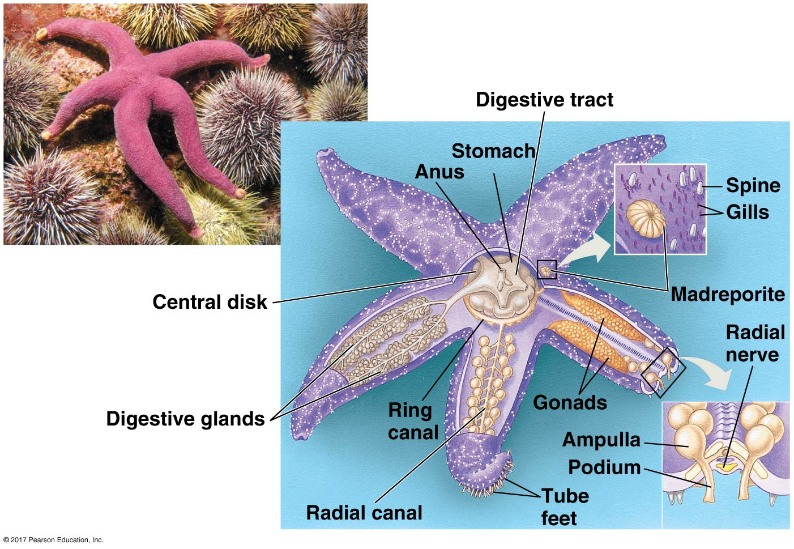

## Deutrostome Clade

* **Includes phylum Echinoderns (Inverts) and phylum Chordata (Verterbrates)**
    + DNA evidence points to relatedness between these groups
    + Independent evolution of each group

 

* **Deutrostome = Developmental similarities**
    + radial cleavage
    + anus from blastophore

 

* **HOWEVER: other animal phyla share some of these traits**
    + Deutrostomes now mostly DNA (modern)

    
  
##

## Phylum Echinoderms

 

* **Translates to 'Spiny Skin'**
    + sea stars and urchins
    + slow moving and marine
    + adult = radial, larval = bilateral

 

* **Thin epidermis covered in hard plates**
    + often with bumps or spines

     
    
* **Possess a unique water vascular system**
    + hydarulic canals = *tube feet*

##

## History of bacbones: ~500 million years old

 
 

* **Evolved while large predators where developing**
    + Cambian period
    + Ocean origins (first 150 mya)
    
 

* **Vertebrate: series of bones that make up the vertebral column**
    + 57,000 species

 

* **Vertrebrates colonized land 365 mya**
1. Amphibians
2. Reptiles (w/ birds)
3. Mammals

## Phylum Chordata

 

* **Bilateral symmetry and deuterostomes**

 

* **2 invertebrates groups that are more related to vertebrates**
    + Cephalchordata (lacelets)
    + Urchordates (tunicates)

 

* **All chordates shared specific traits, however, some only in embryo stages**
1. Notochord
2. Dorsal, hollow nerve cord
3. Pharyngeal slots
4. Muscular, Post-anal tail

##

##

## Vertebrates are chordates with a backbone

 
 

* **Possess skeletal and nervous systems**
    + simple to complex backbones
    + lots of unique genes (eg HOX)

 

* **Derived traits = neural crest**
    + special cells near neural tube in embryo
    + give rise to many verterbrate traits
    + eg. teeth, skull cartilidge, etc

## Hagfish and Lampreys

* **Only members of vertebrates without jaws**
    + sister groups

 

* **Have rudimentay backbones**
    + more cartilidge than bone

 

* **Hagfish escape by releasing slime**
    + researched to stop bleeding in surgery

    
## Hagfish and Lampreys

* **Only members of vertebrates without jaws**
    + sister groups

 

* **Have rudimentay backbones**
    + more cartilidge than bone

 

* **Hagfish escape by releasing slime**
    + researched to stop bleeding in surgery

 

* **Many Lampreys are parasitic on fish**
    + invaded Great Lakes

## Vertebrates with jaws

## Sharks and rays

## Coelacanths and Lungfishes

## Amphibians (frogs and salamanders)

## Reptiles (tutles, snakes, crocodiles)

## Mammals