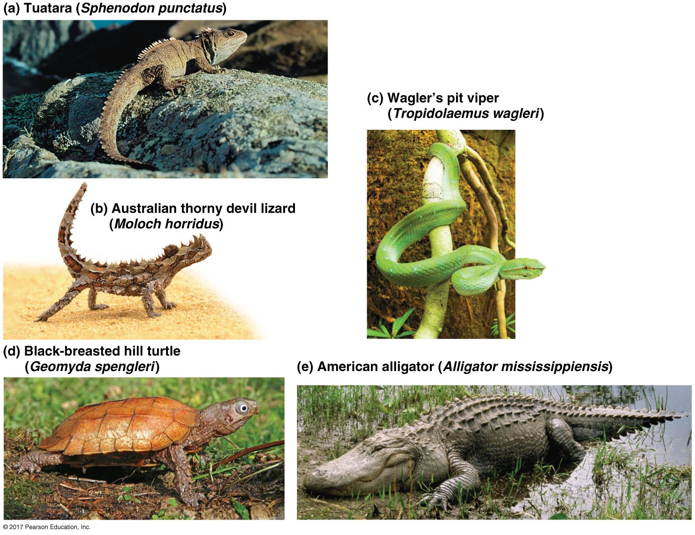

## Deuterostome clade

 

* **Phylum Echinoderms (Invertebrates)**
* **Phylum Chordata (mostly Vertebrates)**

 

* **Deuterostome = Developmental similarities**
    + radial cleavage of embryo
    + anus forms first (then mouth)

 

* **HOWEVER: other animal phyla share some of these traits**
    + Deuterostomes now defined by DNA

## Protostome vs Deuterostome

**Groups differ in how the digestive system developes**
 
 
 
 

* **Two groups differ by embryonic development of the blastopore (the first developmental opening) and the alignment of embryonic cells after fertilization**

 

* **Protostome = Mouth develops first**

 

* **Deuterostome = Mouth develops second**

## Sexual reproduction in animals results in diploid zygote

## **Radial Cleavage: daughter cells are exactly on top of one another**

## Phylum Echinoderms

 

* **Translates to 'Spiny Skin'**
    + sea stars and urchins
    + slow moving and marine
    + adult = radial, larval = bilateral

 

* **Thin epidermis covered in hard plates**
    + often with bumps or spines

## Phylum Echinoderms

 

* **Translates to 'Spiny Skin'**
    + sea stars and urchins
    + slow moving and marine
    + adult = radial, larval = bilateral

 

* **Thin epidermis covered in hard plates**
    + often with bumps or spines

 

* **Possess a unique water vascular system**
    + flexible hydraulic canals = *tube feet*

## Phylum Chordata (mostly vertebrates)

 

* **All chordates share 4 traits**
* **Some only in embryo stages**
1. Notochord
2. Dorsal, hollow nerve cord
3. Pharyngeal slits
4. Muscular, Post-anal tail

 

* **2 invertebrates groups that are more related to vertebrates**
    + Cephlachordata (lancelets)
    + Urochordates (tunicates)

##

## Lancelets and Tunicates (invertebrates)

## Vertebrates are chordates with a backbone

 
 
 

* **Possess skeletal and nervous systems**
    + simple to complex backbones
    + lots of unique genes (eg. HOX)

 
 

* **Derived trait = neural crest**
    + special stem cells near neural tube in embryo
    + give rise to many vertebrate traits
    + e.g.. teeth, skull, cartilage, etc

## History of backbones: ~525 million years old

 

* **Evolved while predators where developing**
    + Cambrian period
    + Ocean origins

 

* **Vertebrate: series of *bones* that make up the vertebral column**
    + 57,000 species

 

* **Vertebrates with limbs colonized land 365 mya**
1. Amphibians
2. Reptiles (w/ birds)
3. Mammals

## Hagfish and Lampreys

 

* **Only members of vertebrates without jaws**
    + sister group of jawless fish

 

* **Have rudimentary backbones**
    + more cartilage than bone

 

* **Hagfish escape by releasing slime**
    + slime threads act as hydrogel and rapidly expand when mixed with water
    + researched to stop bleeding in surgery

## Hagfish and Lampreys

 

* **Only members of vertebrates without jaws**
    + sister group of jawless fish

 

* **Have rudimentary backbones**
    + more cartilage than bone

 

* **Many Lamprey are parasitic on fish**
    + invaded Great Lakes
    + native to Chesapeake Bay

## Vertebrates with jaws

## Sharks and rays

 

* **'Cartilage fishes': skeletons mostly cartilage**
    + often with calcium
    + originated 400 mya
    
 

* **Streamlined body for swift swimming**
    + poor maneuverability
    + stay in near constant motion
    
 

* **Birth via eggs or young develop inside mother**

 

* **Modern species diversity massively reduced**

## Ray-finned and Lobe-finned fish

 
 
 
 
 
 

* **Phylogeny: large new vertebrate group with bony endoskeletion**
    + fishes = aquatic groups

 

**Add lungs/lung derivatives to phylogeny**

## Ray-finned and Lobe-finned fishes (lungs on phylogeny)

 
 

* **Important derived traits for fishes:**
    + operculum:
    + swim bladder:

 

* **Ray-finned: bony rays that support fins**
  + trout, sea horses, eels

 

* **Lobe-finned: rod-shaped bone surrounded by muscle in fins**
  + lungfish, *Coelacanths*, earliest tetrapods

## Evolution had to solve a density problem for bony fishes

 
 

* **A fish has a density of about 1.076**
    + freshwater has a density of 1.0
    + saltwater has a density of 1.026

 

* **Bone is nearly twice as dense as cartilage**

 

* **Swimming is energy expensive**
  + resting on the bottom may not be practical
 
  
 
* **Evolution of the swim bladder set fish free**

## Evolution of Tetrapod group

 
 
 

* **Lobe fins gradually evolved into limbs**
    + Tetrapods colonized land 365 mya
    + move away from fish-like vertebrates

 
 

* **Tetrapod derived trait = limbs with digits**
    + supports weight
    + digits efficiently support movement

## Tiktaalik fossil (aka 'Fishapod')

 
 
 
 

* **Fossils found in river beds**

 

* **Selection of many terrestrial traits**
    + head separated from body by a neck
    + more vertebrate to allow head to swing
    + bones of pelvis fuse to backbone
    + many species lost gills (became ears)

## Amphibians (frogs and salamanders)

 

* **Include salamanders, frogs and caecilians**
    + >6,000 species
    + caecilians lost legs

 

* **Rely on skin for gas exchange**
    + live in moist habitats

 

* **Name means 'dual life'**
    + some have aquatic tadpole larvae
    + more related to metamorphosis
    + gills &rarr; legs, lungs, eardrums

## Amniotes: tetrapod with terrestrial egg (also rib cage)

**Amniotic egg contains 4 membranes around embryo. Surrounds embryo with amniotic fluid**

## Reptiles

 
 

* **Lizards, snakes, turtles, crocs and BIRDS**
    + many extinct groups
    + small (16mm) to large (12m)

 

* **Scales with keratin**

 

* **Lay shelled eggs on land**

 

* **Most reptiles are ectothermic**

## Reptiles

 
 

* **Lizards, snakes, turtles, crocs and BIRDS**
    + many extinct groups
    + small (16mm) to large (12m)

 

* **Scales with keratin**

 

* **Lay shelled eggs on land**

 

* **Most reptiles are ectothermic**

## The origin of birds (members of the reptile family tree)

## Mammals

 

* **Large adaptive radiation post dinosaurs**
    + predators, herbivores, flying, aquatic
    + *Monotremes* = platypus (egg laying)
    + *Maruspials* = pouched mammals
    + *Eutherians* = placental mammals

 

* **Derived Trait: Mammary glands**
    + produce milk for offspring
    
 

* **Derived Trait: Hair**
    + insulation/water saver
 

